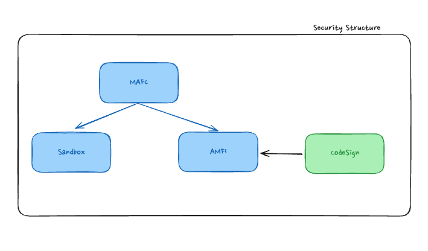
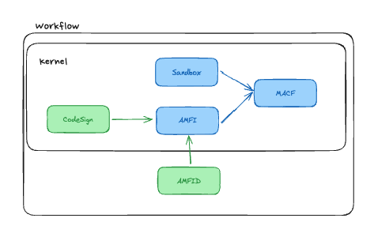
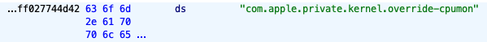

> 코드의 유효성에 대한 결정을 내리는 논리는 외부의 커널 확장 기능에 의해 제공되도록 설계되어 있는 논리

커널확장기능(AMFI) + 사용자 모드 데몬(AMFID)
AMFC는 iOS의 실행 프로파일을 제한시키고 특정 Entitlement를 사용해 커널 보안을 향상시킨다.

# 👉🏻 AppleMobileFileIntegrity.kext



`AppleMobileFileIntegrity`에 대해 자세히 설명하기 전에 먼저 iOS/macOS에서 다루는 보안 구조에 대해 설명해보고자 한다. 먼저, MACF는 커널 확장 기능을 허용할지 말지를 결정해주는 프레임워크다. 그렇기에 위와 같이 MACF는 Sandbox.kext와 AMFI.kext로 나누는 것이다. 전체 구조를 정의내리면 위와 같다는 것이다. 뿐만 아니라 AMFI는 CodeSign에 대해 유효한지를 결정하는 논리를 담고 있다. 그렇기에 Codesign은 AMFI옆에서 도움을 받는다.

이를 기능적인 측면, 즉, 동작과정으로 다시 한번 그려보면 다음과 같다.



CodeSign이 로드된 후에 AMFI는 코드사인이 유효한지 검사를 한다. 이후에 코드사인이 유효하다면 MACF에 허용한다는 값을 보낸다. 마찬가지로 Sandbox에서는 커널이 안전한지 확인을 하고, 안전하다면 MACF에 허용한다는 값을 보낸다. (이때 `AMFID`는 커널의 밖에서 검증을 도와준다.)

AMFI에 대한 공격을 막기 위해서 `PE_I_can_haz_debugger`을 호출한다.
추가로 AMFI는 커널이 초기화되지마자 커널에 자신의 정책을 등록한다.
그렇기에 따로 공격을 진행할 수 없다.

# 👉🏻 MACF 정책

## proc_check_cpumon(\*OS)

- com.apple.private.kernel.override-cpumon Entitlement 확인
  

## proc_check_inherit_ipc_ports

- 테스크포트를 소유하게 되면 무제한의 권한을 얻게 됨.
- 상속포트의 경우에는 예외정책을 정해 다른테스크가 권한을 갖게 함.

## proc_check_get-task

- get-task-allow

  - 애플에서 개발자 인증서와 함께 제공하는 인타이틀먼트
  - 외부 프로세스가 해당 태스크의 태스크 포트를 요청하고 얻을 수 있도록 허용하는 동작방식.

- task_for_pid-allow
  - 시스템의 어떠한 다른 태스크 포트에도 접근할 수 있게 해주는 Entitlement
    ![[스크린샷 2024-01-14 07.02.48.png]]

## proc_check_map_anon

익명을 의미하는 `anonymous` 를 사용하는 이유는 파일 매핑과 달리 메모리를 매핑할 때 따로 파일로 저장되는 메모리가 없기 때문이다.

```
  if ((bVar1 && param_5 == 0) && param_6 == 0x800) {
LAB_fffffff028ef31cc:
    lVar4 = FUN_fffffff028eeb84c(param_2);
    if (lVar4 == 0) {
      uVar2 = 1;
    }
    else {
      uVar2 = FUN_fffffff028ee9bdc(lVar4,"dynamic-codesigning");
      uVar2 = uVar2 ^ 1;
    }
  }
  else {
    uVar3 = FUN_fffffff028ee8980();
    if ((uVar3 & 1) == 0) {
      FUN_fffffff028199f74(param_1);
      pcVar5 =
      "%s: process %d attempted to use MAP_JIT but developer mode status has not been resolved!\n";
    }
    else {
      if (DAT_fffffff02a3a5570 != 0) goto LAB_fffffff028ef31cc;
      FUN_fffffff028199f74(param_1);
      pcVar5 = "%s: process %d attempted to use MAP_JIT, but device still locked!\n";
    }
    FUN_fffffff02832ca6c(pcVar5);
    uVar2 = 0x10;
  }
  return uVar2;
}
```

위의 코드는 MAP_JIT에 관한 소스코드이다.
먼저 param_6이 0x800다. 이는 flag가 MAP_JIT(0x800)를 의미한다고 볼 수 있다.

이후 조건문에서는 3가지를 검증한다.
먼저 MAP_JIT인 경우에 AMFI는 dynamic-codesigning entitlement를 확인한다.

> [!dynmaic-codesigning이란?]
> </br>
> 코드서명을 자유롭게 이용할 수 있게 함.
> 그렇기에 시스템 관련 바이너리에만 부여됨.

## file_check_mmap

mmap은 메모리를 획득하여 그에 대한 보호를 설정할 수 있는 일반적인 메커니즘이다.
`file_check_mmap`은 해당 매핑이 쓰기가 가능하고 검증이 필요한 경우, 내부 라이브러리 검증 루틴을 호출.

## proc_check_library_validation

## proc_check_mprotect

## proc_check_run_cs_invalid

## vnode_check_exec

## vnode_check_signature

## cred_label_update_execve

## 예외훅
