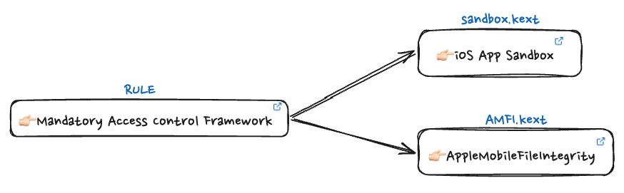

> 사용자가 제어할 수 있는 커널 기능의 모든 측면(강제되는 정책)

MACF는 결정을 `정책 모듈` 이라는 특수한 커널 확장 기능들에게 맡긴다.

# 👉🏻 용어

MACF에 대해 설명하기 전에 먼저 `DAC`와 `MAC`의 차이점을 알아야한다. `DAC`은 `Discretionary Access Control` 의 약자로서 사용자가 사용권한을 사용자 마음대로 설정할 수 있는 모델이다. 이에 반해 `MAC`은 `Mandatory Access Control Framework`의 약자로 관리자가 사용권한을 설정하고 사용자는 그 설정된 권한을 따라야 하는 모델이다.

MAC 모델을 `프레임워크화` 한 것을 `MACF`라고 할 수 있다. 즉, 애플이 직접 커널영역에서 제작하여 배포한 것이다. 뿐만 아니라 프레임워크화로 인해 집중적으로 분석해야 하는 동작들을 프레임워크에 등록할 수 있다. 이를 애플에서는 `커널확장 기능에 의해 커널로부터 적절하게 분리된다고 표현한다.`

MACF는 앞서 말했듯이 프레임워크다. 프레임워크 안에서 등록된 정책(확장기능)들이 있다. 이들을 호출하게 되고 그 결정에 따라 MACF는 동작을 허용해야할지 말아야할지를 결정하게 된다.

> 즉, MACF는 정책결정을 하는 프레임워크를 의미하고, 프레임워크안에 등록된 정책들이 커널에게 줄 수 있는 확장기능을 말한다.



> 애플은 MAC 모델을 따르고 있는데 이로 인해 관리자인 `애플만이` 이 정책을 만들고 수정할 수 있다.

```
❯ kextstat | grep -B 1 dsep                                                                                                                             ─╯

    com.apple.kpi.bsd
    com.apple.kpi.dsep
```

https://github.com/excitedplus1s/jtool2

# 👉🏻 MACF 정책

MACF 정책 등록은 다음의 과정으로 진행된다.


그렇다면 mac_policy_conf 구조체는 어떻게 구성되어 있을까 ?
이는 ios와 macos의 원조격인 xnu 의 소스코드를 보면 확인할 수 있다.

```header
/**
 *  @brief Mac policy configuration
 *
 *  This structure specifies the configuration information for a
 *  MAC policy module.  A policy module developer must supply
 *  a short unique policy name, a more descriptive full name, a list of label
 *  namespaces and count, a pointer to the registered enty point operations,
 *  any load time flags, and optionally, a pointer to a label slot identifier.
 *
 *  The Framework will update the runtime flags (mpc_runtime_flags) to
 *  indicate that the module has been registered.
 *
 *  If the label slot identifier (mpc_field_off) is NULL, the Framework
 *  will not provide label storage for the policy.  Otherwise, the
 *  Framework will store the label location (slot) in this field.
 *
 *  The mpc_list field is used by the Framework and should not be
 *  modified by policies.
 */
/* XXX - reorder these for better aligment on 64bit platforms */
struct mac_policy_conf {
	const char              *mpc_name;              /** policy name */
	const char              *mpc_fullname;          /** full name */
	char const * const *mpc_labelnames;     /** managed label namespaces */
	unsigned int             mpc_labelname_count;   /** number of managed label namespaces */
	const struct mac_policy_ops     *mpc_ops;               /** operation vector */
	int                      mpc_loadtime_flags;    /** load time flags */
	int                     *mpc_field_off;         /** label slot */
	int                      mpc_runtime_flags;     /** run time flags */
	mpc_t                    mpc_list;              /** List reference */
	void                    *mpc_data;              /** module data */
};
```

위의 코드에서 볼 수 있듯이 `mac_policy_conf`는 10개의 항목을 가진 구조체이다.

- `mpc_name` : 정책 이름
- `mpc_fullname` : full name
- `mpc_labelnames` : 정책이 적용되려고 하는 레이블 네임스페이스. Label이 없을 경우에는 NULL, 있을 경우 슬롯에 저장.
- `mpc_labelname_count` : Label 네임스페이스 수
- `mpc_ops` : 정책이 적용되는 동작 지정
- `mpc_loadtime_flags`: loadtime_flag
- `mpc_field_off` : label이 저장되는 슬롯 offset
- `mpc_runtime_flags` : runtime_flag
- `mpc_list` : List refer
- `mpc_data` : 정책 모듈 데이터

위의 10가지를 정의 및 초기화한 후 mac_policy_register를 호출해야 한다.
여기서 mac_policy_register는 다음과 같다.

```header
/**
 *  @brief MAC policy module registration routine
 *
 *  This function is called to register a policy with the
 *  MAC framework.  A policy module will typically call this from the
 *  Darwin KEXT registration routine.
 */
int     mac_policy_register(struct mac_policy_conf *mpc,
    mac_policy_handle_t *handlep, void *xd);
```

이 mac_policy_conf는 MAC_POLICY_SET 메크로에서 사용이 되는데 MAC_POLICY_SET는 다음과 같다.

```header
#define MAC_POLICY_SET(handle, mpops, mpname, mpfullname, lnames, lcount, slot, lflags, rflags) \
	static struct mac_policy_conf mpname##_mac_policy_conf = {      \
	        .mpc_name		= #mpname,                      \
	        .mpc_fullname		= mpfullname,                   \
	        .mpc_labelnames		= lnames,                       \
	        .mpc_labelname_count	= lcount,                       \
	        .mpc_ops		= mpops,                        \
	        .mpc_loadtime_flags	= lflags,                       \
	        .mpc_field_off		= slot,                         \
	        .mpc_runtime_flags	= rflags                        \
	};                                                              \
                                                                        \
	static kern_return_t                                            \
	kmod_start(kmod_info_t *ki, void *xd)                           \
	{                                                               \
	        return mac_policy_register(&mpname##_mac_policy_conf,   \
	            &handle, xd);                                       \
	}                                                               \
                                                                        \
	static kern_return_t                                            \
	kmod_stop(kmod_info_t *ki, void *xd)                            \
	{                                                               \
	        return mac_policy_unregister(handle);                   \
	}                                                               \
                                                                        \
	extern kern_return_t _start(kmod_info_t *ki, void *data);       \
	extern kern_return_t _stop(kmod_info_t *ki, void *data);        \
                                                                        \
	KMOD_EXPLICIT_DECL(security.mpname, POLICY_VER, _start, _stop)  \
	kmod_start_func_t *_realmain = kmod_start;                      \
	kmod_stop_func_t *_antimain = kmod_stop;                        \
	int _kext_apple_cc = __APPLE_CC__
```

MAC_POLICY_SET를 분석해보자!

1. 먼저 mac_policy_conf에서 정의된 변수들을 재선언하고 있다.
2. 그 후에 kmod_start, kmod_stop이라는 메소드를 선언하고 있다.
3. kmod_start와 kmod_stop 메소드를 자세히 들여다보면,
   mac_policy_register와 mac_policy_unregister를 호출하여 정책을 등록하거나,
   등록해제하는 동작을 한다.

AMFI 전체 코드

```header

void FUN_fffffff028eef900(void)

{
  undefined *puVar1;
  code *UNRECOVERED_JUMPTABLE;
  int iVar2;
  undefined8 uVar3;
  ulong uVar4;
  long *plVar5;
  long *plVar6;
  int *piVar7;
  long lVar8;
  undefined8 uVar9;
  long *unaff_x22;
  ulong unaff_x30;
  ulong local_e0;
  undefined8 uStack_d8;
  undefined8 local_d0;
  undefined8 uStack_c8;
  undefined8 uStack_c0;
  undefined8 uStack_b8;
  undefined8 local_b0;
  undefined8 uStack_a8;
  undefined8 uStack_a0;
  undefined8 uStack_98;
  undefined8 local_90;
  undefined8 uStack_88;
  undefined8 uStack_80;
  undefined8 uStack_78;
  undefined8 local_70;
  undefined8 uStack_68;
  undefined8 uStack_60;
  undefined8 uStack_58;
  long local_48;

  local_48 = *(long *)PTR_DAT_fffffff027ac2f20;
  uVar3 = FUN_fffffff02832d084();
  FUN_fffffff027d85270();
  uVar4 = FUN_fffffff0282bad44(0,uVar3,&DAT_fffffff02a3a54f0);
  if ((uVar4 & 1) == 0) {
    FUN_fffffff027d85ec8(uVar3);
    FUN_fffffff02832d0f8(uVar3);
    FUN_fffffff027d85270(DAT_fffffff02a3a54f0);
    if (*(long *)PTR_DAT_fffffff027ac2f20 == local_48) {
      if (((unaff_x30 ^ unaff_x30 << 1) >> 0x3e & 1) != 0) {
                    /* WARNING: Treating indirect jump as call */
        UNRECOVERED_JUMPTABLE = (code *)SoftwareBreakpoint(0xc471,0xfffffff028eefc68);
        (*UNRECOVERED_JUMPTABLE)();
        return;
      }
      FUN_fffffff027d85ec8(DAT_fffffff02a3a54f0);
      return;
    }
    goto LAB_fffffff028eefee0;
  }
  DAT_fffffff02a3a5500 = FUN_fffffff027d84b40(&DAT_fffffff0273f6b4b,0);
  FUN_fffffff028eea774();
  FUN_fffffff0281b4908(&PTR_DAT_fffffff02a3a5428);
  DAT_fffffff027ac47cc = 0;
  uStack_68 = 0;
  local_70 = 0;
  uStack_58 = 0;
  uStack_60 = 0;
  uStack_88 = 0;
  local_90 = 0;
  uStack_78 = 0;
  uStack_80 = 0;
  uStack_a8 = 0;
  local_b0 = 0;
  uStack_98 = 0;
  uStack_a0 = 0;
  uStack_c8 = 0;
  local_d0 = 0;
  uStack_b8 = 0;
  uStack_c0 = 0;
  uStack_d8 = 0;
  local_e0 = 0;
  uVar3 = FUN_fffffff028d76914();
  iVar2 = FUN_fffffff028d70e94(uVar3,&local_e0);
  if (iVar2 != 0) {
                    /* WARNING: Subroutine does not return */
    FUN_fffffff028465690("\"AMFI: No chip from IMG4? errno: %d\" @%s:%d");
  }
  if ((local_b0._5_1_ != '\0') || ((int)uStack_a8 == 1)) {
    DAT_fffffff027ac47cc = 1;
  }
  local_e0 = local_e0 & 0xffffffff00000000;
  iVar2 = FUN_fffffff02843d9e4("cs_enforcement_disable",&local_e0,4);
  if ((iVar2 != 0) && ((int)local_e0 != 0)) {
    FUN_fffffff02832ca6c("%s: cs_enforcement disabled by boot-arg\n");
    iVar2 = FUN_fffffff02843fbd8(0);
    if (iVar2 == 0) goto LAB_fffffff028eeff28;
  }
  puVar1 = PTR_DAT_fffffff027ac2fb8;
  plVar5 = (long *)FUN_fffffff028334660("/chosen",*(undefined8 *)PTR_DAT_fffffff027ac2fb8,0,0,0);
  if (plVar5 == (long *)0x0) {
    FUN_fffffff028f06794();
LAB_fffffff028eeff08:
    FUN_fffffff028f067c0();
LAB_fffffff028eeff0c:
    FUN_fffffff028f06888(unaff_x22,(ulong)unaff_x22 & 0xffffffffffff | 0xcda1000000000000);
LAB_fffffff028eeff1c:
    FUN_fffffff028f067ec();
LAB_fffffff028eeff20:
    FUN_fffffff028f06818();
  }
  else {
    uVar3 = (**(code **)(*plVar5 + 0x118))(plVar5,"amfi-only-platform-code");
    uVar9 = *(undefined8 *)PTR_PTR_DAT_fffffff027ac2ec8;
    plVar6 = (long *)FUN_fffffff0282bb784(uVar3,uVar9);
    if (plVar6 == (long *)0x0) goto LAB_fffffff028eeff08;
    iVar2 = (**(code **)(*plVar6 + 0xa0))();
    unaff_x22 = plVar6;
    if (iVar2 != 4) goto LAB_fffffff028eeff0c;
    piVar7 = (int *)(**(code **)(*plVar6 + 0xd8))(plVar6);
    DAT_fffffff027ac47c1 = *piVar7 == 0;
    (**(code **)(*plVar5 + 0x28))(plVar5);
    FUN_fffffff028ef4844();
    FUN_fffffff028eebc2c(1);
    FUN_fffffff028eedd70();
    DAT_fffffff027ac47c2 = '\x01';
    plVar5 = (long *)FUN_fffffff028334660(&DAT_fffffff0273f6d21,*(undefined8 *)puVar1,0,0,0);
    if (plVar5 == (long *)0x0) goto LAB_fffffff028eeff1c;
    uVar3 = (**(code **)(*plVar5 + 0x118))(plVar5,"model");
    plVar5 = (long *)FUN_fffffff0282bb784(uVar3,uVar9);
    if (plVar5 == (long *)0x0) goto LAB_fffffff028eeff20;
    uVar3 = (**(code **)(*plVar5 + 0xd8))();
    FUN_fffffff02832ca6c("AMFI: queried model name from device tree: %s\n");
    lVar8 = FUN_fffffff027e76b4c(uVar3,"iPhone",6);
    if (lVar8 == 0) {
      if (DAT_fffffff027ac47c2 == '\0') goto LAB_fffffff028eefbf8;
    }
    else {
      FUN_fffffff02832ca6c("AMFI: disabling Swift Playgrounds JIT services on iPhone devices\n");
      DAT_fffffff027ac47c2 = '\0';
LAB_fffffff028eefbf8:
      FUN_fffffff0281ce538(0x10000000);
      FUN_fffffff0281ce538(0x20000000);
    }
    DAT_fffffff02a3a54b8 = FUN_fffffff02832d084();
    FUN_fffffff028ee6b04();
    DAT_fffffff027ac4800 = &LAB_fffffff028ef0504;
    DAT_fffffff027ac4828 = FUN_fffffff028ef0510;
    DAT_fffffff027ac4838 = FUN_fffffff028ef05e8;
    DAT_fffffff027ac4850 = 0xfffffff028ef06bc;
    DAT_fffffff027ac4860 = FUN_fffffff028eeeba4;
    DAT_fffffff027ac4b88 = FUN_fffffff028ef06d0;
    DAT_fffffff027ac5150 = 0xfffffff028ef0a40;
    DAT_fffffff027ac49d0 = FUN_fffffff028eeb210;
    DAT_fffffff027ac4b70 = &LAB_fffffff028ef25e8;
    DAT_fffffff027ac4b78 = FUN_fffffff028ef25f0;
    DAT_fffffff027ac4ae8 = FUN_fffffff028ef2f98;
    DAT_fffffff027ac4820 = FUN_fffffff028ef30b8;
    DAT_fffffff027ac4928 = FUN_fffffff028eebd2c;
    DAT_fffffff027ac4cf0 = &LAB_fffffff028ef3144;
    DAT_fffffff027ac51a8 = FUN_fffffff028ef3150;
    DAT_fffffff027ac4fe0 = FUN_fffffff028ef324c;
    DAT_fffffff027ac4ad8 = FUN_fffffff028ef3278;
    DAT_fffffff027ac4ae0 = FUN_fffffff028ef3278;
    DAT_fffffff027ac4cb8 = &DAT_fffffff028ef3408;
    DAT_fffffff027ac5168 = FUN_fffffff028ef3414;
    DAT_fffffff027ac4db8 = FUN_fffffff028ef34d4;
    DAT_fffffff027ac48f0 = FUN_fffffff028eea7b4;
    DAT_fffffff027ac51f0 = &DAT_fffffff028eef114;
    DAT_fffffff027ac5248 = &DAT_fffffff0273f6b4b;
    DAT_fffffff027ac5250 = "Apple Mobile File Integrity";
    DAT_fffffff027ac5258 = &PTR_DAT_fffffff027ac5880;
    DAT_fffffff027ac5260 = 1;
    DAT_fffffff027ac5268 = &DAT_fffffff027ac47d0;
    DAT_fffffff027ac5270 = 0;
    DAT_fffffff027ac5278 = &DAT_fffffff027ac47c8;
    DAT_fffffff027ac5280 = 0;
    iVar2 = FUN_fffffff0284416b0(&DAT_fffffff027ac5248,&DAT_fffffff027ac47c4,0);
    if (iVar2 == 0) {
      FUN_fffffff028ee8754();
      FUN_fffffff027d85ec8(DAT_fffffff02a3a54f0);
      if (*(long *)PTR_DAT_fffffff027ac2f20 == local_48) {
        return;
      }
LAB_fffffff028eefee0:
                    /* WARNING: Subroutine does not return */
      FUN_fffffff027d3ab6c();
    }
  }
  FUN_fffffff028f06844();
LAB_fffffff028eeff28:
  FUN_fffffff028f06768();
  FUN_fffffff02832ca6c(&DAT_fffffff0273f6a59);
                    /* WARNING: Subroutine does not return */
  FUN_fffffff028465690("\"Cannot unload AMFI - policy is not dynamic\\n\" @%s:%d");
}
```

AMFI 전체 코드는 다음과 같다.
위의 코드는 iphone15 kenrenlcache를 disassembling 한 후 다시 디컴파일 한 코드이다.
이때 소스코드 마지막에서 `FUN_fffffff028465690("\"Cannot unload AMFI - policy is not dynamic\\n\" @%s:%d");`의 소스코드를 확인할 수 있었고, 이를 통해 AMFI의 정책은 동적으로 Load됨을 확인할 수 있었다.

mac_policy.h에서 mac_policy_ops 구조체는 다음과 같이 정의되어 있다.

```header
/*
 * Policy module operations.
 *
 * Please note that this should be kept in sync with the check assumptions
 * policy in bsd/kern/policy_check.c (policy_ops struct).
 */
#define MAC_POLICY_OPS_VERSION 75 /* inc when new reserved slots are taken */
struct mac_policy_ops {
mpo_audit_check_postselect_t            *mpo_audit_check_postselect;
	mpo_audit_check_preselect_t             *mpo_audit_check_preselect;

	mpo_reserved_hook_t                     *mpo_reserved01;
	mpo_reserved_hook_t                     *mpo_reserved02;
	mpo_reserved_hook_t                     *mpo_reserved03;
	mpo_reserved_hook_t                     *mpo_reserved04;

	mpo_cred_check_label_update_execve_t    *mpo_cred_check_label_update_execve;
	mpo_cred_check_label_update_t           *mpo_cred_check_label_update;
	mpo_cred_check_visible_t                *mpo_cred_check_visible;
	mpo_cred_label_associate_fork_t         *mpo_cred_label_associate_fork;
	mpo_cred_label_associate_kernel_t       *mpo_cred_label_associate_kernel;
	mpo_cred_label_associate_t              *mpo_cred_label_associate;
	mpo_cred_label_associate_user_t         *mpo_cred_label_associate_user;
	mpo_cred_label_destroy_t                *mpo_cred_label_destroy;
	mpo_cred_label_externalize_audit_t      *mpo_cred_label_externalize_audit;
	mpo_cred_label_externalize_t            *mpo_cred_label_externalize;
	mpo_cred_label_init_t                   *mpo_cred_label_init;
	mpo_cred_label_internalize_t            *mpo_cred_label_internalize;
	mpo_cred_label_update_execve_t          *mpo_cred_label_update_execve;
	mpo_cred_label_update_t                 *mpo_cred_label_update;

	mpo_devfs_label_associate_device_t      *mpo_devfs_label_associate_device;
	mpo_devfs_label_associate_directory_t   *mpo_devfs_label_associate_directory;
	mpo_devfs_label_copy_t                  *mpo_devfs_label_copy;
	mpo_devfs_label_destroy_t               *mpo_devfs_label_destroy;
	mpo_devfs_label_init_t                  *mpo_devfs_label_init;
	mpo_devfs_label_update_t                *mpo_devfs_label_update;

	mpo_file_check_change_offset_t          *mpo_file_check_change_offset;
	mpo_file_check_create_t                 *mpo_file_check_create;
	mpo_file_check_dup_t                    *mpo_file_check_dup;
	mpo_file_check_fcntl_t                  *mpo_file_check_fcntl;
	mpo_file_check_get_offset_t             *mpo_file_check_get_offset;
	mpo_file_check_get_t                    *mpo_file_check_get;
	mpo_file_check_inherit_t                *mpo_file_check_inherit;
	mpo_file_check_ioctl_t                  *mpo_file_check_ioctl;
	mpo_file_check_lock_t                   *mpo_file_check_lock;
	mpo_file_check_mmap_downgrade_t         *mpo_file_check_mmap_downgrade;
	mpo_file_check_mmap_t                   *mpo_file_check_mmap;
	mpo_file_check_receive_t                *mpo_file_check_receive;
	mpo_file_check_set_t                    *mpo_file_check_set;
	mpo_file_label_init_t                   *mpo_file_label_init;
	mpo_file_label_destroy_t                *mpo_file_label_destroy;
	mpo_file_label_associate_t              *mpo_file_label_associate;
	mpo_file_notify_close_t                 *mpo_file_notify_close;

	mpo_reserved_hook_t                     *mpo_reserved06;
	mpo_reserved_hook_t                     *mpo_reserved07;
	mpo_reserved_hook_t                     *mpo_reserved08;
	mpo_reserved_hook_t                     *mpo_reserved09;
	mpo_reserved_hook_t                     *mpo_reserved10;
	mpo_reserved_hook_t                     *mpo_reserved11;
	mpo_reserved_hook_t                     *mpo_reserved12;
	mpo_reserved_hook_t                     *mpo_reserved13;
	mpo_reserved_hook_t                     *mpo_reserved14;
	mpo_reserved_hook_t                     *mpo_reserved15;
	mpo_reserved_hook_t                     *mpo_reserved16;
	mpo_reserved_hook_t                     *mpo_reserved17;
	mpo_reserved_hook_t                     *mpo_reserved18;
	mpo_reserved_hook_t                     *mpo_reserved19;
	mpo_reserved_hook_t                     *mpo_reserved20;
	mpo_reserved_hook_t                     *mpo_reserved21;
	mpo_reserved_hook_t                     *mpo_reserved22;
	mpo_reserved_hook_t                     *mpo_reserved23;
	mpo_reserved_hook_t                     *mpo_reserved24;

	mpo_necp_check_open_t                   *mpo_necp_check_open;
	mpo_necp_check_client_action_t          *mpo_necp_check_client_action;

	mpo_file_check_library_validation_t     *mpo_file_check_library_validation;

	mpo_vnode_notify_setacl_t               *mpo_vnode_notify_setacl;
	mpo_vnode_notify_setattrlist_t          *mpo_vnode_notify_setattrlist;
	mpo_vnode_notify_setextattr_t           *mpo_vnode_notify_setextattr;
	mpo_vnode_notify_setflags_t             *mpo_vnode_notify_setflags;
	mpo_vnode_notify_setmode_t              *mpo_vnode_notify_setmode;
	mpo_vnode_notify_setowner_t             *mpo_vnode_notify_setowner;
	mpo_vnode_notify_setutimes_t            *mpo_vnode_notify_setutimes;
	mpo_vnode_notify_truncate_t             *mpo_vnode_notify_truncate;
	mpo_vnode_check_getattrlistbulk_t       *mpo_vnode_check_getattrlistbulk;

	mpo_reserved_hook_t                     *mpo_reserved28;
	mpo_reserved_hook_t                     *mpo_reserved29;
	mpo_reserved_hook_t                     *mpo_reserved30;
	mpo_reserved_hook_t                     *mpo_reserved31;
	mpo_reserved_hook_t                     *mpo_reserved32;
	mpo_reserved_hook_t                     *mpo_reserved33;
	mpo_reserved_hook_t                     *mpo_reserved34;
	mpo_reserved_hook_t                     *mpo_reserved35;
	mpo_reserved_hook_t                     *mpo_reserved36;

	mpo_mount_check_quotactl_t              *mpo_mount_check_quotactl;
	mpo_mount_check_fsctl_t                 *mpo_mount_check_fsctl;
	mpo_mount_check_getattr_t               *mpo_mount_check_getattr;
	mpo_mount_check_label_update_t          *mpo_mount_check_label_update;
	mpo_mount_check_mount_t                 *mpo_mount_check_mount;
	mpo_mount_check_remount_t               *mpo_mount_check_remount;
	mpo_mount_check_setattr_t               *mpo_mount_check_setattr;
	mpo_mount_check_stat_t                  *mpo_mount_check_stat;
	mpo_mount_check_umount_t                *mpo_mount_check_umount;
	mpo_mount_label_associate_t             *mpo_mount_label_associate;
	mpo_mount_label_destroy_t               *mpo_mount_label_destroy;
	mpo_mount_label_externalize_t           *mpo_mount_label_externalize;
	mpo_mount_label_init_t                  *mpo_mount_label_init;
	mpo_mount_label_internalize_t           *mpo_mount_label_internalize;

	mpo_proc_check_expose_task_with_flavor_t *mpo_proc_check_expose_task_with_flavor;
	mpo_proc_check_get_task_with_flavor_t   *mpo_proc_check_get_task_with_flavor;
	mpo_proc_check_task_id_token_get_task_t *mpo_proc_check_task_id_token_get_task;

	mpo_pipe_check_ioctl_t                  *mpo_pipe_check_ioctl;
	mpo_pipe_check_kqfilter_t               *mpo_pipe_check_kqfilter;
	mpo_reserved_hook_t                     *mpo_reserved41;
	mpo_pipe_check_read_t                   *mpo_pipe_check_read;
	mpo_pipe_check_select_t                 *mpo_pipe_check_select;
	mpo_pipe_check_stat_t                   *mpo_pipe_check_stat;
	mpo_pipe_check_write_t                  *mpo_pipe_check_write;
	mpo_pipe_label_associate_t              *mpo_pipe_label_associate;
	mpo_reserved_hook_t                     *mpo_reserved42;
	mpo_pipe_label_destroy_t                *mpo_pipe_label_destroy;
	mpo_reserved_hook_t                     *mpo_reserved43;
	mpo_pipe_label_init_t                   *mpo_pipe_label_init;
	mpo_reserved_hook_t                     *mpo_reserved44;
	mpo_reserved_hook_t                     *mpo_reserved45;

	mpo_policy_destroy_t                    *mpo_policy_destroy;
	mpo_policy_init_t                       *mpo_policy_init;
	mpo_policy_initbsd_t                    *mpo_policy_initbsd;
	mpo_policy_syscall_t                    *mpo_policy_syscall;

	mpo_system_check_sysctlbyname_t         *mpo_system_check_sysctlbyname;
	mpo_proc_check_inherit_ipc_ports_t      *mpo_proc_check_inherit_ipc_ports;
	mpo_vnode_check_rename_t                *mpo_vnode_check_rename;
	mpo_kext_check_query_t                  *mpo_kext_check_query;
	mpo_proc_notify_exec_complete_t         *mpo_proc_notify_exec_complete;
	mpo_proc_notify_cs_invalidated_t        *mpo_proc_notify_cs_invalidated;
	mpo_proc_check_syscall_unix_t           *mpo_proc_check_syscall_unix;
	mpo_proc_check_expose_task_t            *mpo_proc_check_expose_task;            /* Deprecating, use mpo_proc_check_expose_task_with_flavor instead */
	mpo_proc_check_set_host_special_port_t  *mpo_proc_check_set_host_special_port;
	mpo_proc_check_set_host_exception_port_t *mpo_proc_check_set_host_exception_port;
	mpo_exc_action_check_exception_send_t   *mpo_exc_action_check_exception_send;
	mpo_exc_action_label_associate_t        *mpo_exc_action_label_associate;
	mpo_exc_action_label_populate_t         *mpo_exc_action_label_populate;
	mpo_exc_action_label_destroy_t          *mpo_exc_action_label_destroy;
	mpo_exc_action_label_init_t             *mpo_exc_action_label_init;
	mpo_exc_action_label_update_t           *mpo_exc_action_label_update;

	mpo_vnode_check_trigger_resolve_t       *mpo_vnode_check_trigger_resolve;
	mpo_mount_check_mount_late_t            *mpo_mount_check_mount_late;
	mpo_mount_check_snapshot_mount_t        *mpo_mount_check_snapshot_mount;
	mpo_vnode_notify_reclaim_t              *mpo_vnode_notify_reclaim;
	mpo_skywalk_flow_check_connect_t        *mpo_skywalk_flow_check_connect;
	mpo_skywalk_flow_check_listen_t         *mpo_skywalk_flow_check_listen;

	mpo_posixsem_check_create_t             *mpo_posixsem_check_create;
	mpo_posixsem_check_open_t               *mpo_posixsem_check_open;
	mpo_posixsem_check_post_t               *mpo_posixsem_check_post;
	mpo_posixsem_check_unlink_t             *mpo_posixsem_check_unlink;
	mpo_posixsem_check_wait_t               *mpo_posixsem_check_wait;
	mpo_posixsem_label_associate_t          *mpo_posixsem_label_associate;
	mpo_posixsem_label_destroy_t            *mpo_posixsem_label_destroy;
	mpo_posixsem_label_init_t               *mpo_posixsem_label_init;
	mpo_posixshm_check_create_t             *mpo_posixshm_check_create;
	mpo_posixshm_check_mmap_t               *mpo_posixshm_check_mmap;
	mpo_posixshm_check_open_t               *mpo_posixshm_check_open;
	mpo_posixshm_check_stat_t               *mpo_posixshm_check_stat;
	mpo_posixshm_check_truncate_t           *mpo_posixshm_check_truncate;
	mpo_posixshm_check_unlink_t             *mpo_posixshm_check_unlink;
	mpo_posixshm_label_associate_t          *mpo_posixshm_label_associate;
	mpo_posixshm_label_destroy_t            *mpo_posixshm_label_destroy;
	mpo_posixshm_label_init_t               *mpo_posixshm_label_init;

	mpo_proc_check_debug_t                  *mpo_proc_check_debug;
	mpo_proc_check_fork_t                   *mpo_proc_check_fork;
	mpo_proc_check_get_task_name_t          *mpo_proc_check_get_task_name; /* Deprecating, use mpo_proc_check_get_task_with_flavor instead */
	mpo_proc_check_get_task_t               *mpo_proc_check_get_task;      /* Deprecating, use mpo_proc_check_get_task_with_flavor instead */
	mpo_proc_check_getaudit_t               *mpo_proc_check_getaudit;
	mpo_proc_check_getauid_t                *mpo_proc_check_getauid;
	mpo_proc_check_getlcid_t                *mpo_proc_check_getlcid;
	mpo_proc_check_mprotect_t               *mpo_proc_check_mprotect;
	mpo_proc_check_sched_t                  *mpo_proc_check_sched;
	mpo_proc_check_setaudit_t               *mpo_proc_check_setaudit;
	mpo_proc_check_setauid_t                *mpo_proc_check_setauid;
	mpo_proc_check_setlcid_t                *mpo_proc_check_setlcid;
	mpo_proc_check_signal_t                 *mpo_proc_check_signal;
	mpo_proc_check_wait_t                   *mpo_proc_check_wait;
	mpo_proc_check_dump_core_t              *mpo_proc_check_dump_core;
	mpo_proc_check_remote_thread_create_t   *mpo_proc_check_remote_thread_create;

	mpo_socket_check_accept_t               *mpo_socket_check_accept;
	mpo_socket_check_accepted_t             *mpo_socket_check_accepted;
	mpo_socket_check_bind_t                 *mpo_socket_check_bind;
	mpo_socket_check_connect_t              *mpo_socket_check_connect;
	mpo_socket_check_create_t               *mpo_socket_check_create;
	mpo_reserved_hook_t                     *mpo_reserved46;
	mpo_reserved_hook_t                     *mpo_reserved47;
	mpo_reserved_hook_t                     *mpo_reserved48;
	mpo_socket_check_listen_t               *mpo_socket_check_listen;
	mpo_socket_check_receive_t              *mpo_socket_check_receive;
	mpo_socket_check_received_t             *mpo_socket_check_received;
	mpo_reserved_hook_t                     *mpo_reserved49;
	mpo_socket_check_send_t                 *mpo_socket_check_send;
	mpo_socket_check_stat_t                 *mpo_socket_check_stat;
	mpo_socket_check_setsockopt_t           *mpo_socket_check_setsockopt;
	mpo_socket_check_getsockopt_t           *mpo_socket_check_getsockopt;

	mpo_proc_check_get_movable_control_port_t *mpo_proc_check_get_movable_control_port;
	mpo_proc_check_dyld_process_info_notify_register_t *mpo_proc_check_dyld_process_info_notify_register;
	mpo_reserved_hook_t                     *mpo_reserved52;
	mpo_reserved_hook_t                     *mpo_reserved53;
	mpo_reserved_hook_t                     *mpo_reserved54;
	mpo_reserved_hook_t                     *mpo_reserved55;
	mpo_reserved_hook_t                     *mpo_reserved56;
	mpo_reserved_hook_t                     *mpo_reserved57;
	mpo_reserved_hook_t                     *mpo_reserved58;

	mpo_proc_check_memorystatus_control_t   *mpo_proc_check_memorystatus_control;
	mpo_proc_check_work_interval_ctl_t      *mpo_proc_check_work_interval_ctl;

	mpo_reserved_hook_t                     *mpo_reserved61;

	mpo_iokit_check_open_service_t          *mpo_iokit_check_open_service;

	mpo_system_check_acct_t                 *mpo_system_check_acct;
	mpo_system_check_audit_t                *mpo_system_check_audit;
	mpo_system_check_auditctl_t             *mpo_system_check_auditctl;
	mpo_system_check_auditon_t              *mpo_system_check_auditon;
	mpo_system_check_host_priv_t            *mpo_system_check_host_priv;
	mpo_system_check_nfsd_t                 *mpo_system_check_nfsd;
	mpo_system_check_reboot_t               *mpo_system_check_reboot;
	mpo_system_check_settime_t              *mpo_system_check_settime;
	mpo_system_check_swapoff_t              *mpo_system_check_swapoff;
	mpo_system_check_swapon_t               *mpo_system_check_swapon;
	mpo_socket_check_ioctl_t                *mpo_socket_check_ioctl;

	mpo_sysvmsg_label_associate_t           *mpo_sysvmsg_label_associate;
	mpo_sysvmsg_label_destroy_t             *mpo_sysvmsg_label_destroy;
	mpo_sysvmsg_label_init_t                *mpo_sysvmsg_label_init;
	mpo_sysvmsg_label_recycle_t             *mpo_sysvmsg_label_recycle;
	mpo_sysvmsq_check_enqueue_t             *mpo_sysvmsq_check_enqueue;
	mpo_sysvmsq_check_msgrcv_t              *mpo_sysvmsq_check_msgrcv;
	mpo_sysvmsq_check_msgrmid_t             *mpo_sysvmsq_check_msgrmid;
	mpo_sysvmsq_check_msqctl_t              *mpo_sysvmsq_check_msqctl;
	mpo_sysvmsq_check_msqget_t              *mpo_sysvmsq_check_msqget;
	mpo_sysvmsq_check_msqrcv_t              *mpo_sysvmsq_check_msqrcv;
	mpo_sysvmsq_check_msqsnd_t              *mpo_sysvmsq_check_msqsnd;
	mpo_sysvmsq_label_associate_t           *mpo_sysvmsq_label_associate;
	mpo_sysvmsq_label_destroy_t             *mpo_sysvmsq_label_destroy;
	mpo_sysvmsq_label_init_t                *mpo_sysvmsq_label_init;
	mpo_sysvmsq_label_recycle_t             *mpo_sysvmsq_label_recycle;
	mpo_sysvsem_check_semctl_t              *mpo_sysvsem_check_semctl;
	mpo_sysvsem_check_semget_t              *mpo_sysvsem_check_semget;
	mpo_sysvsem_check_semop_t               *mpo_sysvsem_check_semop;
	mpo_sysvsem_label_associate_t           *mpo_sysvsem_label_associate;
	mpo_sysvsem_label_destroy_t             *mpo_sysvsem_label_destroy;
	mpo_sysvsem_label_init_t                *mpo_sysvsem_label_init;
	mpo_sysvsem_label_recycle_t             *mpo_sysvsem_label_recycle;
	mpo_sysvshm_check_shmat_t               *mpo_sysvshm_check_shmat;
	mpo_sysvshm_check_shmctl_t              *mpo_sysvshm_check_shmctl;
	mpo_sysvshm_check_shmdt_t               *mpo_sysvshm_check_shmdt;
	mpo_sysvshm_check_shmget_t              *mpo_sysvshm_check_shmget;
	mpo_sysvshm_label_associate_t           *mpo_sysvshm_label_associate;
	mpo_sysvshm_label_destroy_t             *mpo_sysvshm_label_destroy;
	mpo_sysvshm_label_init_t                *mpo_sysvshm_label_init;
	mpo_sysvshm_label_recycle_t             *mpo_sysvshm_label_recycle;

	mpo_proc_notify_exit_t                  *mpo_proc_notify_exit;
	mpo_mount_check_snapshot_revert_t       *mpo_mount_check_snapshot_revert;
	mpo_vnode_check_getattr_t               *mpo_vnode_check_getattr;
	mpo_mount_check_snapshot_create_t       *mpo_mount_check_snapshot_create;
	mpo_mount_check_snapshot_delete_t       *mpo_mount_check_snapshot_delete;
	mpo_vnode_check_clone_t                 *mpo_vnode_check_clone;
	mpo_proc_check_get_cs_info_t            *mpo_proc_check_get_cs_info;
	mpo_proc_check_set_cs_info_t            *mpo_proc_check_set_cs_info;

	mpo_iokit_check_hid_control_t           *mpo_iokit_check_hid_control;

	mpo_vnode_check_access_t                *mpo_vnode_check_access;
	mpo_vnode_check_chdir_t                 *mpo_vnode_check_chdir;
	mpo_vnode_check_chroot_t                *mpo_vnode_check_chroot;
	mpo_vnode_check_create_t                *mpo_vnode_check_create;
	mpo_vnode_check_deleteextattr_t         *mpo_vnode_check_deleteextattr;
	mpo_vnode_check_exchangedata_t          *mpo_vnode_check_exchangedata;
	mpo_vnode_check_exec_t                  *mpo_vnode_check_exec;
	mpo_vnode_check_getattrlist_t           *mpo_vnode_check_getattrlist;
	mpo_vnode_check_getextattr_t            *mpo_vnode_check_getextattr;
	mpo_vnode_check_ioctl_t                 *mpo_vnode_check_ioctl;
	mpo_vnode_check_kqfilter_t              *mpo_vnode_check_kqfilter;
	mpo_vnode_check_label_update_t          *mpo_vnode_check_label_update;
	mpo_vnode_check_link_t                  *mpo_vnode_check_link;
	mpo_vnode_check_listextattr_t           *mpo_vnode_check_listextattr;
	mpo_vnode_check_lookup_t                *mpo_vnode_check_lookup;
	mpo_vnode_check_open_t                  *mpo_vnode_check_open;
	mpo_vnode_check_read_t                  *mpo_vnode_check_read;
	mpo_vnode_check_readdir_t               *mpo_vnode_check_readdir;
	mpo_vnode_check_readlink_t              *mpo_vnode_check_readlink;
	mpo_vnode_check_rename_from_t           *mpo_vnode_check_rename_from;
	mpo_vnode_check_rename_to_t             *mpo_vnode_check_rename_to;
	mpo_vnode_check_revoke_t                *mpo_vnode_check_revoke;
	mpo_vnode_check_select_t                *mpo_vnode_check_select;
	mpo_vnode_check_setattrlist_t           *mpo_vnode_check_setattrlist;
	mpo_vnode_check_setextattr_t            *mpo_vnode_check_setextattr;
	mpo_vnode_check_setflags_t              *mpo_vnode_check_setflags;
	mpo_vnode_check_setmode_t               *mpo_vnode_check_setmode;
	mpo_vnode_check_setowner_t              *mpo_vnode_check_setowner;
	mpo_vnode_check_setutimes_t             *mpo_vnode_check_setutimes;
	mpo_vnode_check_stat_t                  *mpo_vnode_check_stat;
	mpo_vnode_check_truncate_t              *mpo_vnode_check_truncate;
	mpo_vnode_check_unlink_t                *mpo_vnode_check_unlink;
	mpo_vnode_check_write_t                 *mpo_vnode_check_write;
	mpo_vnode_label_associate_devfs_t       *mpo_vnode_label_associate_devfs;
	mpo_vnode_label_associate_extattr_t     *mpo_vnode_label_associate_extattr;
	mpo_vnode_label_associate_file_t        *mpo_vnode_label_associate_file;
	mpo_vnode_label_associate_pipe_t        *mpo_vnode_label_associate_pipe;
	mpo_vnode_label_associate_posixsem_t    *mpo_vnode_label_associate_posixsem;
	mpo_vnode_label_associate_posixshm_t    *mpo_vnode_label_associate_posixshm;
	mpo_vnode_label_associate_singlelabel_t *mpo_vnode_label_associate_singlelabel;
	mpo_vnode_label_associate_socket_t      *mpo_vnode_label_associate_socket;
	mpo_vnode_label_copy_t                  *mpo_vnode_label_copy;
	mpo_vnode_label_destroy_t               *mpo_vnode_label_destroy;
	mpo_vnode_label_externalize_audit_t     *mpo_vnode_label_externalize_audit;
	mpo_vnode_label_externalize_t           *mpo_vnode_label_externalize;
	mpo_vnode_label_init_t                  *mpo_vnode_label_init;
	mpo_vnode_label_internalize_t           *mpo_vnode_label_internalize;
	mpo_vnode_label_recycle_t               *mpo_vnode_label_recycle;
	mpo_vnode_label_store_t                 *mpo_vnode_label_store;
	mpo_vnode_label_update_extattr_t        *mpo_vnode_label_update_extattr;
	mpo_vnode_label_update_t                *mpo_vnode_label_update;
	mpo_vnode_notify_create_t               *mpo_vnode_notify_create;
	mpo_vnode_check_signature_t             *mpo_vnode_check_signature;
	mpo_vnode_check_uipc_bind_t             *mpo_vnode_check_uipc_bind;
	mpo_vnode_check_uipc_connect_t          *mpo_vnode_check_uipc_connect;

	mpo_proc_check_run_cs_invalid_t         *mpo_proc_check_run_cs_invalid;
	mpo_proc_check_suspend_resume_t         *mpo_proc_check_suspend_resume;

	mpo_thread_userret_t                    *mpo_thread_userret;

	mpo_iokit_check_set_properties_t        *mpo_iokit_check_set_properties;

	mpo_vnode_check_supplemental_signature_t *mpo_vnode_check_supplemental_signature;

	mpo_vnode_check_searchfs_t              *mpo_vnode_check_searchfs;

	mpo_priv_check_t                        *mpo_priv_check;
	mpo_priv_grant_t                        *mpo_priv_grant;

	mpo_proc_check_map_anon_t               *mpo_proc_check_map_anon;

	mpo_vnode_check_fsgetpath_t             *mpo_vnode_check_fsgetpath;

	mpo_iokit_check_open_t                  *mpo_iokit_check_open;

	mpo_proc_check_ledger_t                 *mpo_proc_check_ledger;

	mpo_vnode_notify_rename_t               *mpo_vnode_notify_rename;

	mpo_vnode_check_setacl_t                *mpo_vnode_check_setacl;

	mpo_vnode_notify_deleteextattr_t        *mpo_vnode_notify_deleteextattr;

	mpo_system_check_kas_info_t             *mpo_system_check_kas_info;

	mpo_vnode_check_lookup_preflight_t      *mpo_vnode_check_lookup_preflight;

	mpo_vnode_notify_open_t                 *mpo_vnode_notify_open;

	mpo_system_check_info_t                 *mpo_system_check_info;

	mpo_pty_notify_grant_t                  *mpo_pty_notify_grant;
	mpo_pty_notify_close_t                  *mpo_pty_notify_close;

	mpo_vnode_find_sigs_t                   *mpo_vnode_find_sigs;

	mpo_kext_check_load_t                   *mpo_kext_check_load;
	mpo_kext_check_unload_t                 *mpo_kext_check_unload;

	mpo_proc_check_proc_info_t              *mpo_proc_check_proc_info;
	mpo_vnode_notify_link_t                 *mpo_vnode_notify_link;
	mpo_iokit_check_filter_properties_t     *mpo_iokit_check_filter_properties;
	mpo_iokit_check_get_property_t          *mpo_iokit_check_get_property;
};
```

# 👉🏻 MACF 설정

다음은 Kernel_bootstrap 메소드에서 일어나는 과정이다.
bootstrap은 부팅시 가장 먼저 시작되는 초기화 과정으로서,
시스템 및 초기 스레드 생성과 관련된 작업을 수행한다.

```
/*
 * Now running in a thread.  Kick off other services,
 * invoke user bootstrap, enter pageout loop.
 */
static void
kernel_bootstrap_thread(void)
{
	processor_t		processor = current_processor();

#define kernel_bootstrap_thread_kprintf(x...) /* kprintf("kernel_bootstrap_thread: " x) */
	kernel_bootstrap_thread_log("idle_thread_create");
	/*
	 * Create the idle processor thread.
	 */
	idle_thread_create(processor);

	/*
	 * N.B. Do not stick anything else
	 * before this point.
	 *
	 * Start up the scheduler services.
	 */
	kernel_bootstrap_thread_log("sched_startup");
	sched_startup();

	/*
	 * Thread lifecycle maintenance (teardown, stack allocation)
	 */
	kernel_bootstrap_thread_log("thread_daemon_init");
	thread_daemon_init();

	/* Create kernel map entry reserve */
	vm_kernel_reserved_entry_init();

	/*
	 * Thread callout service.
	 */
	kernel_bootstrap_thread_log("thread_call_initialize");
	thread_call_initialize();

	/*
	 * Remain on current processor as
	 * additional processors come online.
	 */
	kernel_bootstrap_thread_log("thread_bind");
	thread_bind(processor);

#if __arm64__
	if (IORamDiskBSDRoot()) {
		cpm_preallocate_early();
	}
#endif /* __arm64__ */

	/*
	 * Initialize ipc thread call support.
	 */
	kernel_bootstrap_thread_log("ipc_thread_call_init");
	ipc_thread_call_init();

	/*
	 * Kick off memory mapping adjustments.
	 */
	kernel_bootstrap_thread_log("mapping_adjust");
	mapping_adjust();

	/*
	 *	Create the clock service.
	 */
	kernel_bootstrap_thread_log("clock_service_create");
	clock_service_create();

	/*
	 *	Create the device service.
	 */
	device_service_create();

	kth_started = 1;

#if (defined(__i386__) || defined(__x86_64__)) && NCOPY_WINDOWS > 0
	/*
	 * Create and initialize the physical copy window for processor 0
	 * This is required before starting kicking off  IOKit.
	 */
	cpu_physwindow_init(0);
#endif

	if (PE_i_can_has_debugger(NULL)) {
		unsigned int phys_carveout_mb = 0;
		if (PE_parse_boot_argn("phys_carveout_mb", &phys_carveout_mb,
				sizeof(phys_carveout_mb)) && phys_carveout_mb > 0) {
			phys_carveout_size = phys_carveout_mb * 1024 * 1024;
			kern_return_t kr = kmem_alloc_contig(kernel_map,
					(vm_offset_t *)&phys_carveout, phys_carveout_size,
					VM_MAP_PAGE_MASK(kernel_map), 0, 0, KMA_NOPAGEWAIT,
					VM_KERN_MEMORY_DIAG);
			if (kr != KERN_SUCCESS) {
				kprintf("failed to allocate %uMB for phys_carveout_mb: %u\n",
						phys_carveout_mb, (unsigned int)kr);
			} else {
				phys_carveout_pa = kvtophys((vm_offset_t)phys_carveout);
			}
		}
	}

#if MACH_KDP
	kernel_bootstrap_log("kdp_init");
	kdp_init();
#endif

#if ALTERNATE_DEBUGGER
	alternate_debugger_init();
#endif

#if KPC
	kpc_init();
#endif

#if CONFIG_ECC_LOGGING
	ecc_log_init();
#endif

#if HYPERVISOR
	hv_support_init();
#endif

#if CONFIG_TELEMETRY
	kernel_bootstrap_log("bootprofile_init");
	bootprofile_init();
#endif

#if (defined(__i386__) || defined(__x86_64__)) && CONFIG_VMX
	vmx_init();
#endif

	kernel_bootstrap_thread_log("ktrace_init");
	ktrace_init();

	kdebug_init(new_nkdbufs, trace_typefilter, trace_wrap);

#ifdef	MACH_BSD
	kernel_bootstrap_log("bsd_early_init");
	bsd_early_init();
#endif

#if defined(__arm64__)
	ml_lockdown_init();
#endif

#ifdef	IOKIT
	kernel_bootstrap_log("PE_init_iokit");
	PE_init_iokit();
#endif

	assert(ml_get_interrupts_enabled() == FALSE);

	/*
	 * Past this point, kernel subsystems that expect to operate with
	 * interrupts or preemption enabled may begin enforcement.
	 */
	early_boot_complete = TRUE;

#if INTERRUPT_MASKED_DEBUG
	// Reset interrupts masked timeout before we enable interrupts
	ml_spin_debug_clear_self();
#endif
	(void) spllo();		/* Allow interruptions */

#if (defined(__i386__) || defined(__x86_64__)) && NCOPY_WINDOWS > 0
	/*
	 * Create and initialize the copy window for processor 0
	 * This also allocates window space for all other processors.
	 * However, this is dependent on the number of processors - so this call
	 * must be after IOKit has been started because IOKit performs processor
	 * discovery.
	 */
	cpu_userwindow_init(0);
#endif

	/*
	 *	Initialize the shared region module.
	 */
	vm_shared_region_init();
	vm_commpage_init();
	vm_commpage_text_init();

#if CONFIG_MACF
	kernel_bootstrap_log("mac_policy_initmach");
	mac_policy_initmach();
#if CONFIG_VNGUARD
	vnguard_policy_init();
#endif
#endif

#if CONFIG_DTRACE
	dtrace_early_init();
	sdt_early_init();
#endif


	/*
	 * Get rid of segments used to bootstrap kext loading. This removes
	 * the KLD, PRELINK symtab, LINKEDIT, and symtab segments/load commands.
	 * Must be done prior to lockdown so that we can free (and possibly relocate)
	 * the static KVA mappings used for the jettisoned bootstrap segments.
	 */
	OSKextRemoveKextBootstrap();
#if defined(__arm__) || defined(__arm64__)
#if CONFIG_KERNEL_INTEGRITY
	machine_lockdown_preflight();
#endif
	/*
	 *  Finalize protections on statically mapped pages now that comm page mapping is established.
	 */
	arm_vm_prot_finalize(PE_state.bootArgs);
#endif

#if CONFIG_SCHED_SFI
	kernel_bootstrap_log("sfi_init");
	sfi_init();
#endif

	/*
	 * Initialize the globals used for permuting kernel
	 * addresses that may be exported to userland as tokens
	 * using VM_KERNEL_ADDRPERM()/VM_KERNEL_ADDRPERM_EXTERNAL().
	 * Force the random number to be odd to avoid mapping a non-zero
	 * word-aligned address to zero via addition.
	 * Note: at this stage we can use the cryptographically secure PRNG
	 * rather than early_random().
	 */
	read_random(&vm_kernel_addrperm, sizeof(vm_kernel_addrperm));
	vm_kernel_addrperm |= 1;
	read_random(&buf_kernel_addrperm, sizeof(buf_kernel_addrperm));
	buf_kernel_addrperm |= 1;
	read_random(&vm_kernel_addrperm_ext, sizeof(vm_kernel_addrperm_ext));
	vm_kernel_addrperm_ext |= 1;
	read_random(&vm_kernel_addrhash_salt, sizeof(vm_kernel_addrhash_salt));
	read_random(&vm_kernel_addrhash_salt_ext, sizeof(vm_kernel_addrhash_salt_ext));

	vm_set_restrictions();


#ifdef CONFIG_XNUPOST
	kern_return_t result = kernel_list_tests();
	result = kernel_do_post();
	if (result != KERN_SUCCESS) {
		panic("kernel_do_post: Tests failed with result = 0x%08x\n", result);
	}
	kernel_bootstrap_log("kernel_do_post - done");
#endif /* CONFIG_XNUPOST */


	/*
	 *	Start the user bootstrap.
	 */
#ifdef	MACH_BSD
	bsd_init();
#endif


	/*
	 * Get rid of pages used for early boot tracing.
	 */
	kdebug_free_early_buf();

	serial_keyboard_init();		/* Start serial keyboard if wanted */

	vm_page_init_local_q();

	thread_bind(PROCESSOR_NULL);

	/*
	 *	Become the pageout daemon.
	 */
	vm_pageout();
	/*NOTREACHED*/
}

```

# 👉🏻 MACF 콜아웃

MACF의 콜아웃 방식에는 두가지 종류가 있다.
이를 bsd에서는 `mac_proc_check_map_anon` 과 `mac_file_check_mmap`으로 구분한다.
(bsd/kern/kern_mman.c)
mac_proc_check_map_anon은 익명매핑을, mac_file_check_mmap은 파일 매핑을 의미한다.

**<center>_mac_object_opType_opName_</center>**

object에는 약 20개가 있다.

- bpddesc
- cred
- file
- proc
- vnode
- mount
- devfs
- ifnet
- inpcb
- mbuf
- ipq
- pipe
- sysv
- posix
- socket
- kext

onType의 종류로는 2개가 있다.(?)

- check
- notify

onName은 허용하고 싶은 동작이름을 의미한다.

MACF설계방식에는 플래그를 저장하는 방식도 사용된다.
다음은 설정된 flag를 man.c에서 가져온 것이다.

```
#if DEBUG
#define SECURITY_MAC_CTLFLAGS (CTLFLAG_RW | CTLFLAG_LOCKED)
#define SECURITY_MAC_CHECK_ENFORCE 1
#else
#define SECURITY_MAC_CTLFLAGS (CTLFLAG_RD | CTLFLAG_LOCKED)
#define SECURITY_MAC_CHECK_ENFORCE 0
#endif

#define MAC_PROC_CHECK_SUSPEND                  0
#define MAC_PROC_CHECK_RESUME                   1
#define MAC_PROC_CHECK_HIBERNATE                2
#define MAC_PROC_CHECK_SHUTDOWN_SOCKETS         3
#define MAC_PROC_CHECK_PIDBIND                  4


```

다음은 enfore flag가 설정된 MIB이다.

> 여기서 MIB는 Mach Interface Builder의 약자로서 사용된다. 즉, MacOS의 하위 시스템인 Mach 커널과 관련된 인터페이스나 서비스를 구축하는데 사용된 도구들이다.

```bash
❯ sysctl security.mac | grep enforc                                                                                                                     ─╯
security.mac.device_enforce: 1
security.mac.pipe_enforce: 1
security.mac.posixsem_enforce: 1
security.mac.posixshm_enforce: 1
security.mac.proc_enforce: 1
security.mac.socket_enforce: 1
security.mac.system_enforce: 1
security.mac.sysvmsg_enforce: 1
security.mac.sysvsem_enforce: 1
security.mac.sysvshm_enforce: 1
security.mac.vm_enforce: 1
security.mac.vnode_enforce: 1
security.mac.amfi.launch_constraints_enforced: 1
security.mac.amfi.launch_constraints_cc_types_enforced: 15
security.mac.qtn.sandbox_enforce: 1
```

위의 값들은 iOS4.3까지 루트 권한이 있는 경우 설정이 가능했다.

> 대표적으로 vnode_enforce와 proc_enfore가 있다. vnode_enforce는 파일시스템의 노드에 대한 접근 제어 정책을 강제하는 설정. proc_enforce는 프로세스에 대한 접근 제어를 강제하는 설정. 이 두가지를 이용해서 위의 enforce 플래그를 강제로 변경하여 탈옥하였음.

이로 인해 애플에서는 `#ifdef` 를 이용해서 변수를 정의하였음. 이는 위의 man.c에서 확인할 수 있었음.

다음으로는 MACF의 가장 큰 특징을 보여주는 `MAC_CHECK`에 대해 보고자한다.
MAC_CHECK은 /security/mac_internals.c 에 정의되어 있다.
정의는 다음과 같다.

```
/*
 * MAC_CHECK performs the designated check by walking the policy
 * module list and checking with each as to how it feels about the
 * request.  Note that it returns its value via 'error' in the scope
 * of the caller.
 */
#define MAC_CHECK(check, args...) do {                                  \
	struct mac_policy_conf *mpc;                                    \
	u_int i;                                                        \
                                                                        \
	error = 0;                                                      \
	for (i = 0; i < mac_policy_list.staticmax; i++) {               \
	        mpc = mac_policy_list.entries[i].mpc;                   \
	        if (mpc == NULL)                                        \
	                continue;                                       \
                                                                        \
	        if (mpc->mpc_ops->mpo_ ## check != NULL)                \
	                error = mac_error_select(                       \
	                    mpc->mpc_ops->mpo_ ## check (args),         \
	                    error);                                     \
	}                                                               \
	if (mac_policy_list_conditional_busy() != 0) {                  \
	        for (; i <= mac_policy_list.maxindex; i++) {            \
	                mpc = mac_policy_list.entries[i].mpc;           \
	                if (mpc == NULL)                                \
	                        continue;                               \
                                                                        \
	                if (mpc->mpc_ops->mpo_ ## check != NULL)        \
	                        error = mac_error_select(               \
	                            mpc->mpc_ops->mpo_ ## check (args), \
	                            error);                             \
	        }                                                       \
	        mac_policy_list_unbusy();                               \
	}                                                               \
} while (0)
```

위의 훅에서 ` mac_error_select` 메소드 사용이 존재한다. 이는 두가지 오류값을 비교해서 특정오류코드가 다른 오류코드를 우선시하는지 결정하는 코드이다. 따라서 오류가 성공보다 우선시되는데, 이로 인해 MACF정책에 오류가 한가지라도 나오게되면 error를 보이는 이유이다.

# 👉🏻 expose_task
